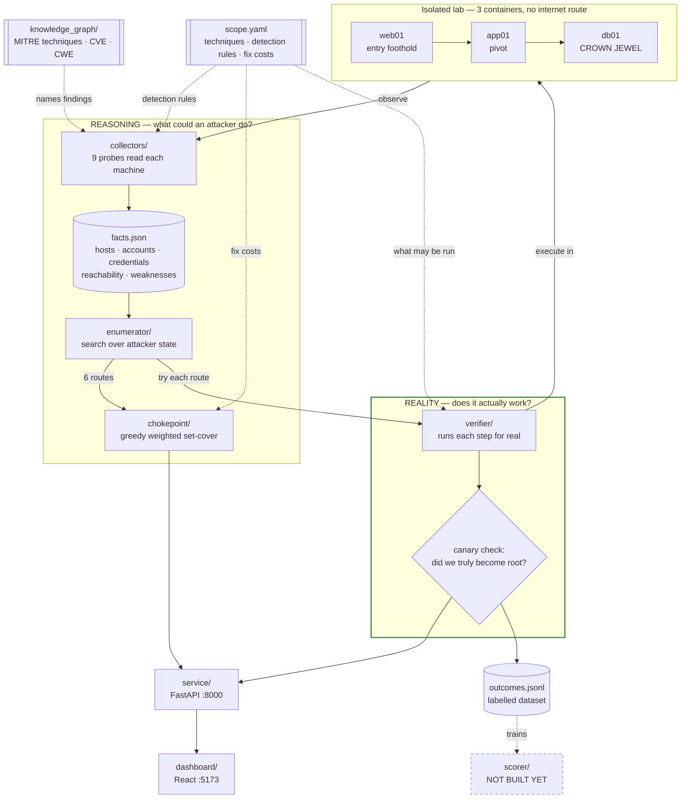

# ASCEND

**A**ttack-path **S**coring and **C**hokepoint **E**valuation for **N**etwork **D**efence.

> ASCEND maps every privilege-escalation route an attacker could take from a
> low-privilege foothold to a critical asset across a Linux network, **proves
> each route by executing it** in an isolated lab, and computes the smallest set
> of fixes that eliminates the most routes.

This is the orientation document. Each module has its own technical README; this
one explains what the project *is* and why it is built the way it is. If you are
joining the team, read this first, then `demo.md` to see it run.

---

## 1. The problem

A real network has hundreds of small misconfigurations. A scanner will happily
list all of them, which is where most tools stop — and that list is close to
useless, because it does not tell you **which ones actually matter together**.

Attackers do not exploit a weakness. They exploit a *chain* of them:

> read a password left in a file → use it to log into another machine →
> abuse a `sudo` rule there to become root → reach the database

Any single link, on its own, might look minor. The chain is what gets you owned.

ASCEND asks two questions a vulnerability list cannot answer:

1. **Which chains actually exist in this network?** Not "here are 40 findings",
   but "here are the 6 concrete routes from the web server to root on the
   database, step by step."
2. **What is the smallest set of fixes that breaks the most chains?** If one
   weakness sits on every route, fixing that one is worth more than patching
   thirty things that sit on none.

The second question is the contribution. Anyone can find problems. ASCEND tells
you the **fewest fixes that remove the most risk**.

## 2. The idea that makes it trustworthy

Here is the trap this whole project is built to avoid.

It would be easy to write a tool that reads some config files, applies a few
rules, and prints a confident list of attack paths. It would look impressive and
nobody could check it. Every number would rest on the author's say-so.

So ASCEND splits cleanly in two:

| | What it does | What it can honestly claim |
|---|---|---|
| **Reasoning** | reads the machines, works out what an attacker *could* do | "the door appears unlocked" |
| **Reality** | goes back to the lab and **actually runs each step** | "we walked through it, here is the output" |

Everything up to the path-finder is reasoning. The **verifier** is what checks
that reasoning against reality. That division is the argument of the project,
and it is why the codebase separates *observing* from *judging* from *proving* at
every level.

A consequence worth internalising: **we would rather show a zero than a
placeholder.** If something cannot be verified, it is reported as unverified,
with the reason — never quietly rounded up.

## 3. How it fits together



Read it as a loop: the collector **observes** the lab, the path-finder
**reasons** over what it found, and the verifier **goes back into the same lab**
to test whether the reasoning was right.

## 4. Walking through it

### The lab

Three Docker containers on two isolated networks — no internet, nothing exposed
to your machine. Weaknesses are deliberately planted:

| Host | Weakness | Technique |
|---|---|---|
| `web01` | an SSH private key readable by everyone | T1552.001 |
| `app01` | `appuser` may run `tar` as root with no password | T1548.003 |
| `app01` + `db01` | **the same key** opens both | T1550 |
| `db01` | a setuid-root `find` | T1548.001 |
| `db01` | a kernel declared vulnerable to DirtyPipe | T1068 |

`app01` is dual-homed; `web01` and `db01` share no network, so they cannot reach
each other. That segmentation matters later.

### The collector

Nine probes read each machine: accounts, file permissions, `sudo` rules, setuid
binaries, SSH keys, listening ports. Two details are worth knowing, because they
are what make the output evidence rather than assertion:

- **Credential reuse is found cryptographically.** Every private key found is
  fingerprinted and compared against every `authorized_keys` on every host. The
  claim "this same key opens two machines" is a SHA256 match, not a filename
  guess.
- **Reachability is measured, not declared.** It opens real TCP connections
  between hosts. That is how it discovers `web01` cannot reach `db01` — nobody
  writes that into a config file.

Crucially, **probes observe and `derive.py` judges**. A probe reports "mode 0644,
owner www-data, contains a private key". The decision that 0644 constitutes a
disclosure lives in one rule in `scope.yaml`. To audit why ASCEND believes
something, you read one rule and one function.

The collector also records what it examined and **deliberately did not report** —
a `sudo` rule for `/bin/ls` (no shell escape), the same key at mode 0600 (only
its owner can read it), a patched 5.10 kernel. A scanner that flags everything
proves nothing; that list is the evidence the rules discriminate.

### The path-finder

Think of the attacker as holding a **set of things**: which machines at which
privilege level, plus which credentials. It starts holding one thing —
`web01` at low privilege — and grows that set one legal move at a time:

1. **Harvest** a credential from a readable file
2. **Move** to another machine using a credential you hold *and* can reach
3. **Escalate** to root where you already have a foothold

Every sequence ending at root on `db01` is a path. This is why it is a
state-space search rather than shortest-path: an attacker never gives up what
they already hold, so "what do I have?" is the right question, not "where am I?"

Move 2 is the interesting one — it needs **both** a working credential **and**
network reachability. That is why key reuse and network segmentation interact,
and why fixing either can break a route.

### The verifier

The hard part is not running an attack. It is knowing whether it *worked* — exit
codes lie, and attacks half-succeed.

So every host carries a **canary**: a file readable only by root, containing a
random secret regenerated each build. Every escalation ends by trying to read it.

> **If the secret comes back, you were root. If it doesn't, you weren't.**

One rule, applied identically to every technique, so results are comparable.

It has **three** outcomes, not two, and the third is the important one:

| Outcome | Meaning |
|---|---|
| `escalated` | ran, and privilege genuinely increased |
| `not_escalated` | ran, and it did not work — a real negative |
| `not_executable` | **never ran**: this lab cannot meet a precondition |

Consider DirtyPipe on `db01`. Containers share the host machine's kernel, so
`db01` does not really run the vulnerable version the graph says it does.
Reporting that as *failed* would claim the attack does not work — a statement
about the world, and a false one. It failed because of our lab. So it is
reported as **not executable, with the reason**, and any route containing it is
**partial**: not proven, and not disproven.

### The chokepoint engine

Ranks fixes by paths eliminated per unit of effort (greedy weighted set-cover).
The effect of each fix is not inferred from the graph — it is **measured**: the
engine removes the fix from a copy of the facts, re-runs the real path-finder,
and compares. That is the same operation the dashboard's *Apply* button performs,
so the prediction and the demonstration cannot disagree.

## 5. Where it stands today

Against the current lab, all of this is real output:

```
4 weaknesses found    6 attack routes    3 verified   3 partial   precision 0.5
                                         19 of 22 individual steps executed and confirmed
```

Three routes are **proven end to end by execution**. The other three each finish
with the kernel exploit and are honestly reported as partial. `db01` is
deliberately reachable two ways — one a container can execute, one it cannot — so
a single run shows both what we can prove and what we refuse to claim.

The recommended fix is the exposed key: it sits on **all six** routes and costs
the least to fix. Patching the DirtyPipe CVE kills only three, because `db01` has
a second route — which is exactly the kind of thing a vulnerability list will
never tell you.

## 6. The modules

| Module | Job | Read |
|---|---|---|
| `scope.yaml` | Single source of truth: techniques, detection rules, fix costs | — |
| `lab/` | The three machines, with weaknesses planted | [`lab/README.md`](lab/README.md) |
| `collectors/` | Reads the machines → `facts.json` | [`collectors/README.md`](collectors/README.md) |
| `knowledge_graph/` | Public reference data so findings are named properly | — |
| `enumerator/` | Finds every route foothold → crown jewel | [`enumerator/README.md`](enumerator/README.md) |
| `chokepoint/` | Ranks fixes by routes killed per unit cost | — |
| `verifier/` | **Runs each step for real** | [`verifier/README.md`](verifier/README.md) |
| `service/` | Ties it together, serves JSON on :8000 | — |
| `dashboard/` | Draws it, on :5173 | — |
| `tests/` | 23 checks, including that nothing claims an unperformed execution | — |

## 7. Running it

```bash
bash lab/down.sh && bash lab/up.sh     # build the lab
python3 collectors/collect.py          # look at it
python3 enumerator/pathfinder.py       # find the routes
.venv/bin/python service/main.py       # API      (own terminal)
cd dashboard && npm run dev            # dashboard (own terminal)
```

- **[`demo.md`](demo.md)** — full setup for a fresh machine (Ubuntu and Arch),
  every command explained, and the demo script with what to say.
- **[`QUICKSTART.md`](QUICKSTART.md)** — shortest path, including a no-Docker
  route that replays a recorded capture.

The path-finder alone needs **no dependencies at all** — standard library only.
It is the fallback when everything else breaks.

## 8. Principles you will run into in the code

These are not style preferences; each one exists because the alternative
produced a wrong number at some point.

1. **Observe, judge, prove — separately.** Probes never decide. Adapters never
   decide their own result. Judgement lives in one place per layer.
2. **Provenance on every fact.** `observed` means a probe measured it;
   `declared` means an operator supplied it and no scan could. Host roles, asset
   values and container kernel versions are declared, and say so.
3. **Three outcomes, never two.** "Did not work" and "could not be attempted"
   are different facts. Collapsing them is how a verifier starts lying.
4. **Negative controls are planted on purpose.** The lab contains weaknesses
   that are *not* findings, so the rules must decline them by name.
5. **The repository ships no exploit code.** The verifier runs a binary someone
   else placed; it never contains or generates one. Tests fail the build if any
   appears.
6. **Measured, not inferred.** A fix's effect is established by re-running the
   path-finder, not by counting occurrences in a graph.

> A cautionary tale that shaped several of these: the lab once shipped a
> "DirtyPipe exploit" that was really a setuid-root program calling `setuid(0)`.
> It returned root because of its file permissions, on any kernel, and the
> verifier recorded the CVE as verified. Removing the setuid bit made it fail on
> an unchanged kernel — proving the "verification" measured a file mode. See
> [`lab/exploits/README.md`](lab/exploits/README.md).

## 9. Not built yet

Stated plainly, and not faked in the meantime:

- **`scorer/`** — the machine-learning model that scores how exploitable each
  step is. `outcomes.jsonl` is its training data; producing that is why the
  verifier exists.
- **Syscall telemetry** — `verifier/telemetry.py` is an interface with no Falco
  behind it. Evidence says `not captured` rather than inventing a log line.
- **A real CVE exploit**, which needs a genuinely vulnerable kernel — so it needs
  virtual machines rather than containers.
- **Credential staging between hops** — a hop is verifiable only where the key is
  already on the source host.

## 10. Where to read next

| If you want | Read |
|---|---|
| To see it run, or present it | [`demo.md`](demo.md) |
| The pitch, scope and the seven techniques | [`docs/01_Overview_Pitch_Scope.md`](docs/01_Overview_Pitch_Scope.md) |
| Architecture diagrams and the data schema | [`docs/02_Architecture_and_Diagrams.md`](docs/02_Architecture_and_Diagrams.md) |
| Who builds what, and when | [`docs/03_Team_Plan_Workstreams_Timeline.md`](docs/03_Team_Plan_Workstreams_Timeline.md) |
| Every term explained, and answers to hard questions | [`docs/04_Defense_Document.md`](docs/04_Defense_Document.md) |
| Why the numbers are defensible | [`docs/06_Evaluation_and_Verifiability.md`](docs/06_Evaluation_and_Verifiability.md) |
| What changed and why, in order | [`docs/DASHBOARD_WIRING_LOG.md`](docs/DASHBOARD_WIRING_LOG.md) |

The work splits three ways: **A** produces truth (lab, collectors, verifier),
**B** turns truth into analysis (graphs, path-finder, scorer, chokepoint), and
**C** makes it runnable and visible (pipeline, dashboard, demo). When unsure who
owns a task, ask which of those three it is.
