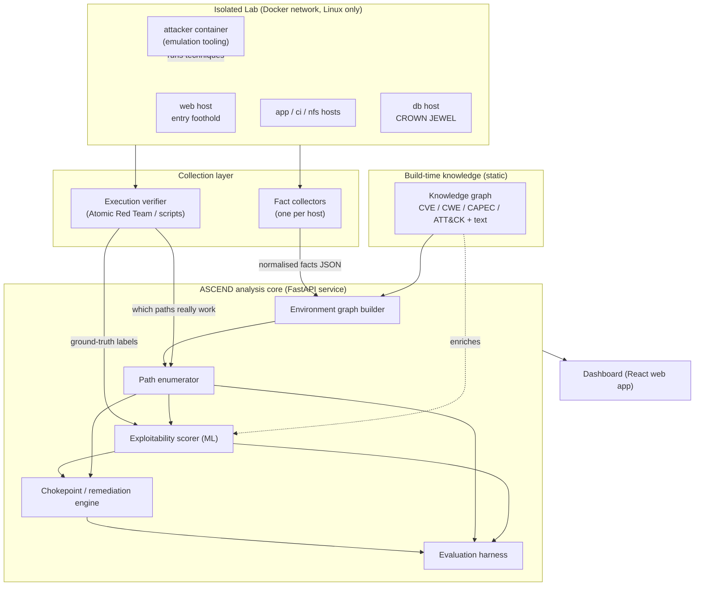
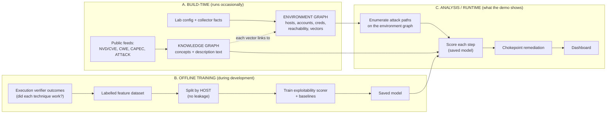
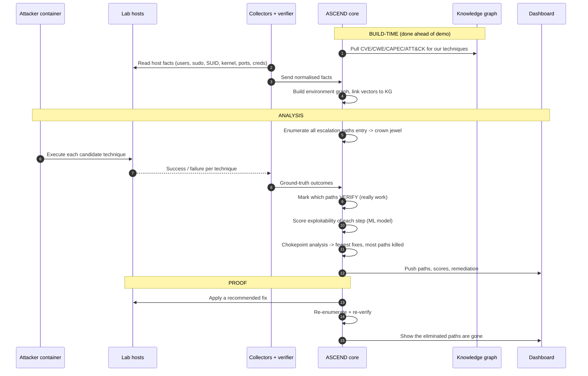
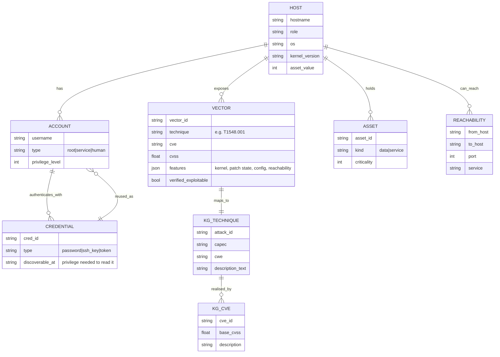
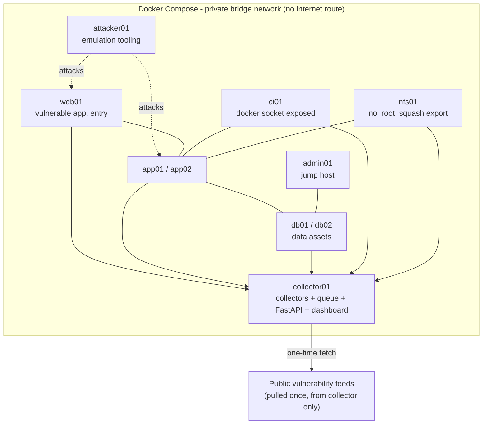
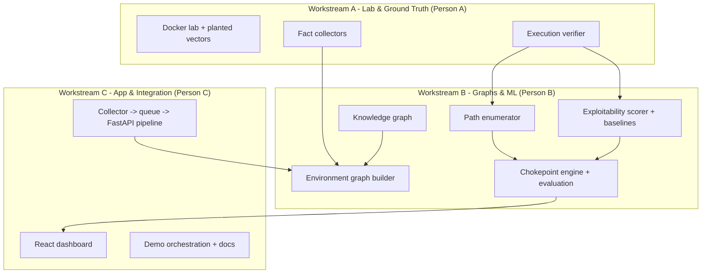

# 02 — Architecture and Diagrams

All diagrams below are written in **Mermaid**. Notion, GitHub, Obsidian and most Markdown tools render these
automatically from the `mermaid` fenced code blocks. Each diagram is followed by a plain-English explanation you
can read aloud at the review.

> **Presentation tip:** for the review slide deck, screenshot each rendered diagram. Keep the explanation paragraph
> as your speaker notes.

---

## 1. System architecture (the whole system on one page)

**Explanation.** On the left is the **isolated lab** — a set of Linux containers on a private Docker network, with
one deliberately vulnerable **web host** (the attacker's entry point) and a **database host** holding the data we
are protecting (the "crown jewel"). An **attacker container** runs the actual attack techniques. Two things watch the
lab: **fact collectors** (which read each host's configuration — users, `sudo` rules, SUID programs, kernel version,
open ports, stored credentials) and the **execution verifier** (which actually *runs* each escalation technique and
records whether it succeeded — this is our ground truth). The collectors' facts, combined with the **knowledge
graph** of public vulnerability data, are assembled into the **environment graph**. The **analysis core** then
enumerates attack paths, scores how exploitable each step is, computes the cheapest remediation, and evaluates
everything. The **dashboard** presents it to an analyst.

---

## 2. The three graphs and three data flows

This is the most important conceptual diagram. ASCEND uses **three distinct graphs**, built at three different
times. Confusing them is what made the earlier "Sentinel" plan hard to follow.

**Explanation.**
- **Flow A — build-time.** The **knowledge graph** captures *public* facts about vulnerabilities and attack
  techniques (it is the same for everyone; refreshed occasionally). The **environment graph** captures *our lab*
  (hosts, accounts, credentials, what can reach what, which weaknesses are present). Each weakness in the
  environment graph is *linked* to the matching concept in the knowledge graph — that link is what turns "the web
  host has CVE-2021-4034" into "the web host is exploitable via technique T1068."
- **Flow B — offline training.** During development we run attacks in the lab, record whether each worked, turn that
  into a labelled dataset, split it **by host** so the model is tested on machines it never trained on, and train the
  exploitability scorer. This produces one file: a saved model. **It never runs during the live demo.**
- **Flow C — analysis / runtime.** This is what the reviewer watches: enumerate the paths, score them with the saved
  model, compute remediation, show it on the dashboard.

---

## 3. End-to-end sequence (what happens, in order)

**Explanation.** Read top to bottom. The build-time steps (pulling public data, reading host facts, assembling the
graph) happen before the review. During analysis, ASCEND enumerates the possible paths, the attacker container
actually runs the techniques, and the outcomes tell us which paths are real. We then score and prioritise, recommend
the cheapest fix, and — the clinching step — *apply the fix and re-run* to prove the paths really disappear. That
last block is the strongest thing to show a panel: the result is demonstrated, not claimed.

---

## 4. Data schema (what the graph actually stores)

**Explanation.** A **HOST** has **ACCOUNTs**, exposes **VECTORs** (privilege-escalation opportunities), may hold
**ASSETs** (valuable data), and has **REACHABILITY** to other hosts. **ACCOUNTs** authenticate with **CREDENTIALs**;
a credential **reused** on another host is the edge that lets an attacker move sideways. Every **VECTOR** maps to a
**KG_TECHNIQUE** (an ATT&CK technique) in the knowledge graph, which is in turn realised by one or more **KG_CVE**
records. The `verified_exploitable` flag on a VECTOR is the ground truth from execution — the field that makes our
numbers trustworthy.

---

## 5. Example: one enumerated attack path

```mermaid
flowchart LR
    E["web01<br/>account: www-data<br/>(low privilege)"]
    E -->|"T1552.001<br/>read SSH key from readable file"| S1["credential:<br/>app deploy key"]
    S1 -->|"T1021.004 + T1550<br/>SSH using reused key"| A["app01<br/>account: appuser"]
    A -->|"T1548.003<br/>sudo misconfig -> root"| AR["app01<br/>account: root"]
    AR -->|"T1021.004<br/>reachable over SSH"| D["db01<br/>account: dbuser"]
    D -->|"T1068<br/>DirtyPipe kernel exploit -> root"| DR["db01 = ROOT<br/>CROWN JEWEL COMPROMISED"]

    style E fill:#e05a5a,color:#fff
    style DR fill:#e0b341,color:#000
```

**Explanation.** This is a single concrete path the enumerator would output. The attacker starts as the
low-privilege `www-data` account on the web host, finds a reusable SSH key in a readable file (**T1552.001**), uses
it to move to the app host (**T1021.004 / T1550**), abuses a `sudo` misconfiguration to become root there
(**T1548.003**), reaches the database host over SSH, and finally uses the DirtyPipe kernel exploit (**T1068**) to
become root on the crown jewel. Each edge is a technique ASCEND can *execute* to confirm the path is real. A
**chokepoint** here might be the reused SSH key: remove it, and every path that relied on it dies at once.

---

## 6. Deployment view (the lab)

**Explanation.** Everything runs as **Docker containers on one private network** with **no route to the internet or
the campus network**, except a single, one-time pull of public vulnerability data from the collector host. Containers
reset in seconds (versus minutes for virtual machines), which matters because building the training dataset requires
hundreds of reset-and-run cycles. If container telemetry ever proves insufficient, the fallback is **three virtual
machines** (attacker, web+app, database) — but containers are the default.

---

## 7. Component / workstream map (who owns what — see doc 03)

**Explanation.** Three parallel workstreams. **A** owns everything that produces ground truth (the lab, the
collectors, the execution verifier). **B** owns the analysis brain (both graphs, path enumeration, the ML scorer,
chokepoint analysis, evaluation). **C** owns the plumbing and the face (the data pipeline, the dashboard, the demo).
The arrows show the hand-off points; §03 turns these into a week-by-week schedule and explains how it degrades to two
people if needed.
